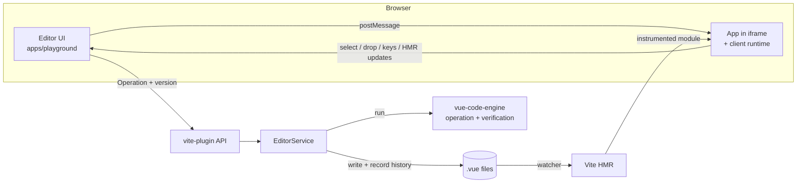

# Architecture

> Status: visual editor (layers, palette, drag & drop, inspector, undo/redo) on top of a verified
> code engine. Name: **vuelume** is provisional (see [ADR-0001](docs/adr/0001-monorepo-and-package-boundaries.md)).

## 1. Goal and principles

A visual editor for **existing** Vue projects where **the `.vue` source code is the source of
truth**. There is no proprietary JSON and no runtime: if the tool is removed, the project stays a
normal Vue app.

Principles, in order of priority:

1. **Never corrupt code.** When in doubt, refuse the edit and say "open in code".
2. **Minimal diffs.** Change only the bytes needed; never re-print or re-format a file.
3. **Preserve what is not understood.** Unknown syntax is kept untouched and reported.
4. **Code-first and visual-first coexist.** Edits from a text editor and from the visual editor
   are equally valid; neither overwrites the other.
5. **Separation of concerns.** Analysis, operations, editor state, preview communication and UI
   are separate layers; the UI never manipulates source text.
6. **Everything is tested**, especially operations (unit, property and real-world corpus tests).

## 2. Packages and layers

```
packages/
  project-model      Plain data: model types, editing protocol (operations, history), canvas
                     protocol (preview ↔ editor messages). No dependencies.
  vue-code-engine    Pure (no fs): analysis + verified operations on a source string.
  project-analyzer   Node, read-only: file discovery, cross-file resolution → ProjectModel.
  vite-plugin        Dev only: preview instrumentation, editing service (writes + history),
                     HTTP API, serves the editor UI.
  cli                `vuelume inspect | tree | set-prop | remove-prop | verify`.
apps/
  playground         Editor UI (Vue 3): Layers, Insert palette, Preview, Inspector.
examples/
  basic-shop         A real Vue 3 + Vite app used as the editing target.
```

| Concern                      | Where                                                                                                                       |
| ---------------------------- | --------------------------------------------------------------------------------------------------------------------------- |
| Analysis of Vue code         | `vue-code-engine` (`analyzeComponent`), `project-analyzer`                                                                  |
| Operations on code           | `vue-code-engine` (`setProp`, `insertNode`, `moveNode`, …)                                                                  |
| Writes, concurrency, history | `vite-plugin/src/service.ts`, `history.ts`                                                                                  |
| Preview communication        | `project-model/src/canvas.ts` (protocol), `vite-plugin/src/client.ts` (runtime in the app), `vite-plugin/src/instrument.ts` |
| Editor state                 | `apps/playground/src/editor.ts` (single store; only place that calls the API)                                               |
| Visual interface             | `apps/playground/src/components/*`                                                                                          |

Dependency direction is one-way:
`project-model ← vue-code-engine ← project-analyzer ← (cli | vite-plugin)`; the UI depends only
on `project-model` (types/protocol) and talks to the plugin over HTTP + `postMessage`.

## 3. Data flow



1. The user acts in the UI (inspector, palette, drag & drop, shortcut).
2. The store turns it into an `Operation` (`setProp`, `setText`, `insertNode`, `moveNode`,
   `wrapNode`, `duplicateNode`, `removeNode`, `removeProp`) with the **version** (content hash)
   of the file the UI last saw.
3. The service rejects stale versions (409), runs project-level checks (component imports,
   required props, target slot), runs the engine operation, re-checks the file just before
   writing, writes, and records the change in the history.
4. Vite's watcher triggers HMR; the instrumented preview re-renders (template edits keep state).
5. The client runtime reports `vuelume:updated`; the UI re-reads affected files (this also covers
   edits made in any other editor).

## 4. The engine: analysis

`@vue/compiler-sfc` raw parser AST for templates and Babel for scripts (ADR-0004). Output:
`ComponentModel` with props (author's type text + `kind`/`options` for widgets, `required`,
`default`), emits, slots, imports, usages (tag → binding → import → resolved file), template tree
with exact ranges, attribute kinds, flags and per-attribute editability. Everything is plain data.

`NodeId` = element index path (`"1.2"`), global identity `{ file, nodeId }` (ADR-0006). Structural
operations return the id of the resulting node so selection stays in sync; when there is none
(removal), the UI clears the selection instead of keeping a shifted id.

## 5. The engine: operations and verification

All operations produce minimal `TextEdit`s on the original source (ADR-0003) and are verified
before returning:

| Operation                                                                      | Verification                                                                                                                                                                                                           |
| ------------------------------------------------------------------------------ | ---------------------------------------------------------------------------------------------------------------------------------------------------------------------------------------------------------------------- |
| `setProp`, `removeProp`                                                        | Edits confined to the start tag; same element; other attributes byte-identical; prop has the requested value                                                                                                           |
| `setText`, `insertNode`, `removeNode`, `moveNode`, `wrapNode`, `duplicateNode` | **Shape verification** (ADR-0009): the operation is applied to the formatting-free shape of the original template; the re-parsed result must have exactly that shape. Other blocks unchanged; requested import present |

Structural rules (refused with a clear error, file untouched):

- nothing between `v-if` / `v-else-if` / `v-else` branches; a chain head with an `else` follower
  cannot be removed, moved, wrapped or duplicated on its own;
- no children in void elements, raw-text elements (`textarea`, …) or `v-html`/`v-text` elements;
- slot templates only inside components, unique per name, reordered only within their component;
  no implicit default content next to an explicit `#default` template;
- no HTML inside inline `<svg>` (only SVG content is rearranged there);
- no moving an element into itself; moves are same-file and atomic (one verified edit set);
- text edits only on elements whose content is plain text (interpolations, child elements,
  `v-html` are shown read-only).

Layout follows the file: one-element-per-line placement with the right indentation, inline when
the author wrote inline, CRLF preserved, blank-line rhythm between siblings kept, moved/wrapped
blocks re-indented except whitespace-sensitive content (attribute values, `<pre>`, `<textarea>`,
interpolations). Component imports are added to `<script setup>` following the existing quote and
semicolon style (or a `<script setup>` is created in template-only files; Options API files are
refused).

Project-level checks live in the service (they need other files): required props without default
must be provided (never invented); inserting a component into itself is refused; an existing
import of the same component is reused; content is refused inside a project component that renders
no matching `<slot>`.

## 6. History (undo/redo)

Server-side, in `EditorService` (ADR-0010). Each applied operation is stored as text patches
(forward + inverse) with the file's content hash before/after. Undo/redo replay a patch only when
the file is exactly at the expected version; if the file changed outside the editor, that file's
history is dropped with an explicit message. History is linear across files and lives as long as
the dev server.

## 7. Preview ↔ source mapping

Dev-only instrumentation in memory (ADR-0008): native elements get `data-vl="<file>:<nodeId>"`,
component usages get `data-vl-u-<hash(file)>="<file>:<nodeId>"` (fallthrough to the child root;
skipped for components known to have several roots). The client runtime resolves a clicked
element to its innermost native node and the chain of enclosing usages, draws hover / selection /
drop overlays, runs in-canvas drags and forwards shortcuts. Drop position (before / after /
inside) follows the parent's flow direction.

## 8. Safe subset for props

| Situation                                                 | Visual editing                         |
| --------------------------------------------------------- | -------------------------------------- |
| `title="x"`, `title='x'`, `title=x`, valueless `featured` | ✅ editable                            |
| `:price="4999"`, `:title="'x'"`, `:ok="true"`, `:n="-1"`  | ✅ editable (literal binding)          |
| static `class` / `style` next to `:class` / `:style`      | ✅ static part editable (Vue merges)   |
| `:title="product.name"` or any non-literal                | ⚠ `advanced-binding` (removal allowed) |
| `:[name]="x"` / modifiers                                 | ⚠ `dynamic-argument` / `modifiers`     |
| element has `v-bind="obj"`                                | ⚠ `spread-binding`                     |
| prop driven by `v-model`                                  | ⚠ `model-binding`                      |
| same prop written twice (`title` + `:title`)              | ⚠ `duplicate`                          |
| `is`, `key`, `ref`                                        | ⚠ `reserved`                           |
| file with parse errors, `<template lang="pug">`           | nothing is edited                      |

## 9. Script analysis

`defineProps` (type-based with local types, runtime object/array, `PropType`), `withDefaults`,
destructure defaults, `defineEmits`, `defineModel`, `defineOptions`, imports and bindings.
Reported, not guessed: imported prop types, generics, Options API props, `<script src>`.

## 10. Extension points (planned)

- **Component metadata providers** (e.g. `vue-component-meta`) for imported/generic prop types.
- **Operations**: new ones follow locate → rules → edit → shape verification.
- **Plugins** (`definePlugin({ panels, inspectors, transforms, commands })`) at the editor level;
  they emit `Operation`s and never bypass verification.

## 11. Risks

See [ROADMAP.md](ROADMAP.md#risks).
