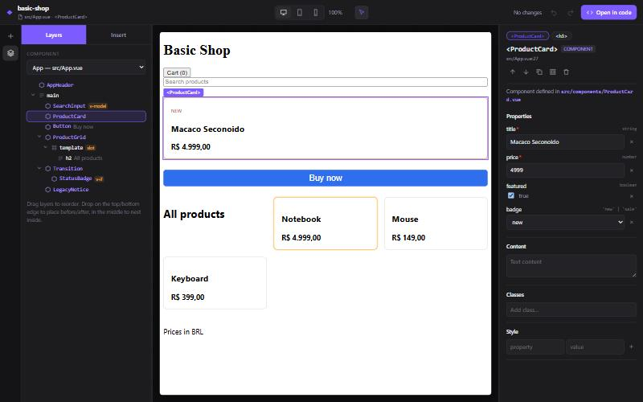

# vuelume _(provisional name)_

**A visual editor for existing Vue projects** — layers, a component palette, drag and drop and an
inspector, working directly on your `.vue` files. No proprietary JSON, no runtime: every visual
change is a small, verified edit of your source, and removing the tool leaves a normal Vue app.

> **Status: early, but usable on Vue 3 + Vite projects that use `<script setup>`.**
> Not published to npm yet: try it from this repository (see below).



## Try the editor

```bash
pnpm install
pnpm build
pnpm --filter basic-shop dev
```

Open the URL printed as `vuelume editor` (e.g. `http://localhost:5173/__vuelume/`). Then:

- **select** anything in the live preview (Alt+click drills into the component) or in **Layers**;
- **edit** props, text, classes, inline styles and attributes in the **Inspector**;
- **insert** project components or HTML elements from **Insert** (click, or drag onto the preview
  or the layers); required props are asked for, never invented;
- **move** elements by dragging them in the layers or in the preview (before / after / inside);
- **duplicate, wrap, move up/down, delete** from the inspector toolbar or the keyboard;
- **undo/redo** every change (Ctrl+Z / Ctrl+Shift+Z) — even across files.

Each action writes the `.vue` file immediately (watch `git diff`); Vite's HMR updates the preview.
Edits made in another editor are picked up live; history never replays over them.

To use it in your own Vite + Vue project (once published, or via a local link):

```ts
// vite.config.ts
import vue from '@vitejs/plugin-vue'
import vuelume from '@vuelume/vite-plugin'

export default defineConfig({ plugins: [vuelume(), vue()] }) // dev only; builds are untouched
```

## How it stays safe

Every change — prop, text, insert, move, wrap, delete — is computed as a minimal text edit and
**verified by re-parsing** before anything is written: the result must parse, other blocks must be
unchanged, and the template must have exactly the structure the operation asked for. Anything the
editor cannot do safely (dynamic bindings, `v-if`/`v-else` chains, content inside `v-html`,
components without the target slot, …) is refused with an explanation and an **Open in code**
link instead of being guessed.

Validated on 7 open-source projects (Element Plus, PrimeVue, Nuxt UI, Directus, vue-vben-admin,
vuejs/docs, Vitesse): **~104k prop edits and ~281k structural operations in memory, 0 corrupted
results** — see [docs/reports/corpus-validation.md](docs/reports/corpus-validation.md).

## CLI

```bash
pnpm vuelume inspect examples/basic-shop                       # components, props, emits, slots
pnpm vuelume tree examples/basic-shop/src/App.vue              # node ids, locations, editability
pnpm vuelume set-prop examples/basic-shop/src/App.vue 1.2 size small   # dry run; --write applies
pnpm vuelume verify path/to/any/vue-project                    # read-only safety self-check
```

## Repository layout

| Path                        | What                                                                       |
| --------------------------- | -------------------------------------------------------------------------- |
| `packages/project-model`    | JSON-serializable model + editing/canvas protocol types                    |
| `packages/vue-code-engine`  | Pure analysis and verified operations (props, text, insert/move/wrap/…)    |
| `packages/project-analyzer` | File discovery and cross-file resolution                                   |
| `packages/vite-plugin`      | Dev-only plugin: preview instrumentation, editing API + history, editor UI |
| `packages/cli`              | The `vuelume` command                                                      |
| `apps/playground`           | The editor UI (Vue), served by the plugin at `/__vuelume/`                 |
| `examples/basic-shop`       | A real Vue 3 + Vite app used as the target in tests and demos              |

Read next: [ARCHITECTURE.md](ARCHITECTURE.md) · [ROADMAP.md](ROADMAP.md) ·
[DECISIONS.md](DECISIONS.md) · [CONTRIBUTING.md](CONTRIBUTING.md) ·
[editor report](VUELUME_EDITOR_REPORT.md)

## Using the engine as a library

```ts
import { insertNode, setProp } from '@vuelume/vue-code-engine'

const result = insertNode(source, {
  target: { nodeId: '1.2', position: 'after' },
  node: { tag: 'Badge', attributes: [{ name: 'label', value: 'New' }] },
  import: { local: 'Badge', source: './Badge.vue' },
})
if (result.ok)
  writeFile(file, result.code) // result.nodeId is the inserted node
else console.warn(result.error.code, result.error.message) // e.g. 'conditional-chain'
```

## Requirements

Node.js ≥ 22.13 and pnpm 11.

## License

[MIT](LICENSE)
