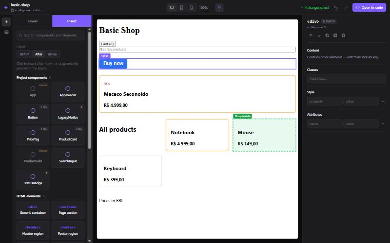
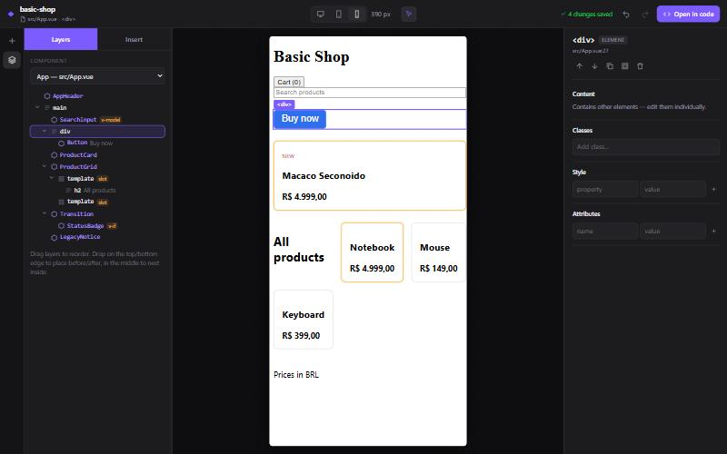

# Vuelume — Relatório da evolução para editor visual

Data: 2026-10-03 · Branch `main` · Escopo: briefing "VUELUME — Evolução para um editor visual completo"

## 1. Resumo

O Vuelume deixou de ser uma prova de conceito de edição de props e virou um **editor visual
utilizável** para projetos Vue 3 + Vite com `<script setup>`. Ele tem árvore de camadas, paleta de
componentes, drag and drop (na árvore e no preview), inspector (props, texto, classes, estilos,
atributos e slots), undo/redo e atalhos de teclado.

Toda alteração continua sendo uma **edição mínima e verificada do próprio `.vue`**. A interface
nunca manipula strings de arquivo: ela envia `Operation`s ao servidor de dev, que as executa pelo
engine e grava o arquivo. Antes de gravar, o engine confere a estrutura resultante por re-parse.

| Evidência                                       | Resultado                                                                                                                                 |
| ----------------------------------------------- | ----------------------------------------------------------------------------------------------------------------------------------------- |
| Testes automatizados                            | **158 testes em 10 arquivos, todos passando**                                                                                             |
| Operações estruturais em 7 projetos open-source | **280.549 operações em memória, 0 resultados errados, 0 exceções**                                                                        |
| Edições de props no mesmo corpus                | **0 falhas** (re-executado após as mudanças)                                                                                              |
| Validação manual no navegador                   | Seleção, inserção, drag and drop, inspector, undo/redo e alteração externa. Os arquivos do exemplo foram restaurados byte a byte ao final |

## 2. Funcionalidades

### 2.1 Implementadas

**Engine de operações estruturais** ([`packages/vue-code-engine/src/structure/`](packages/vue-code-engine/src/structure))

| Operação        | O que faz                                                                                                                                                                                   |
| --------------- | ------------------------------------------------------------------------------------------------------------------------------------------------------------------------------------------- |
| `insertNode`    | Insere um elemento HTML ou componente antes, depois, como primeiro filho ou como último filho. Segue a indentação e o estilo do arquivo e abre componentes auto-fechados quando necessário. |
| `removeNode`    | Remove o elemento (a linha inteira quando ele ocupa linhas próprias).                                                                                                                       |
| `moveNode`      | Move de forma **atômica** (remoção e inserção calculadas sobre o mesmo original e verificadas juntas) e reindenta o bloco.                                                                  |
| `wrapNode`      | Envolve o elemento num novo elemento ou componente, com reindentação.                                                                                                                       |
| `duplicateNode` | Insere uma cópia exata logo depois do elemento.                                                                                                                                             |
| `setText`       | Edita texto estático, preservando o espaço ao redor.                                                                                                                                        |

Comportamento comum a todas:

- **Verificação por forma (ADR-0009).** A operação é aplicada à forma abstrata do template original; o resultado re-parseado precisa ser idêntico. Também se confere que outros blocos não mudaram e que o import pedido existe.
- **Regras explícitas.** São recusadas, com uma mensagem, as operações que quebram chains `v-if`/`v-else-if`/`v-else`, que colocam filhos em elementos void, raw-text ou `v-html`/`v-text`, que violam as regras de slot templates, que colocam HTML dentro de `<svg>` inline ou que movem um elemento para dentro de si mesmo.
- **Imports.** Adiciona o import no `<script setup>` no estilo do arquivo, reaproveita um import existente e recusa conflitos de nome e arquivos Options API. Em arquivos só com template, cria o `<script setup>`.
- **Formatação.** Preserva CRLF, BOM, comentários, tabs e o ritmo de linhas em branco entre irmãos. Não reindenta `<pre>`, `<textarea>`, valores de atributo nem interpolações.

**Histórico** ([`packages/vite-plugin/src/history.ts`](packages/vite-plugin/src/history.ts), [`service.ts`](packages/vite-plugin/src/service.ts))

- Undo/redo de **todas** as operações (props, texto e estruturais), entre arquivos.
- Cada entrada é um patch de texto com o hash do arquivo antes e depois. Nada é reaplicado sobre uma versão diferente.
- Alteração externa (em outro editor): o histórico daquele arquivo é descartado, com uma mensagem clara.
- A seleção anterior à operação é restaurada no undo.

**Serviço de edição e API** ([`packages/vite-plugin/src/`](packages/vite-plugin/src))

- Endpoint único de operações com versão do arquivo (409 quando a versão está desatualizada), mais `undo`, `redo` e `history`.
- Checagens que dependem do projeto:
  - props obrigatórias sem default precisam ser fornecidas (nunca são inventadas);
  - recusa inserir um componente nele mesmo;
  - reaproveita o import existente;
  - recusa conteúdo dentro de um componente do projeto que não renderiza o slot de destino.
- Segurança: escrita só de `.vue` dentro da raiz do projeto, exigência de JSON + mesma origem no POST, dupla checagem de versão antes de gravar.

**Interface** ([`apps/playground/src/`](apps/playground/src))

| Região             | Funcionalidades                                                                                                                                                                                                                                                                                                                                                                                                                                               |
| ------------------ | ------------------------------------------------------------------------------------------------------------------------------------------------------------------------------------------------------------------------------------------------------------------------------------------------------------------------------------------------------------------------------------------------------------------------------------------------------------- |
| Barra superior     | Nome do projeto, arquivo e elemento selecionados, tamanho do preview (desktop, tablet 768 px, mobile 390 px), modo seleção, undo/redo com o rótulo da ação, indicador de alterações ("N changes saved" / "Saving…"), "Open in code"                                                                                                                                                                                                                           |
| Esquerda: Layers   | Seletor de componente, árvore com ícones e badges (`v-for`, `v-if`, `slot`, `v-model`), expandir/recolher, seleção sincronizada (expande ancestrais e rola até o nó), arrastar para reordenar ou aninhar com indicadores antes/depois/dentro, área "soltar no fim"                                                                                                                                                                                            |
| Esquerda: Insert   | Busca, modo de inserção (antes, depois ou dentro da seleção), componentes do projeto e elementos HTML comuns, inserção por clique ou arrasto, diálogo para props obrigatórias, componentes "manual" com o motivo (prop complexa obrigatória, recursão) e aviso quando as props não puderam ser analisadas                                                                                                                                                     |
| Centro: Preview    | O app real em iframe com HMR, hover e seleção com rótulo, todas as instâncias de um `v-for` destacadas, indicadores de drop sensíveis a layouts flex em linha, arrastar o elemento selecionado dentro do canvas, receber itens arrastados da paleta                                                                                                                                                                                                           |
| Direita: Inspector | Breadcrumb (uso no pai → elemento interno), cabeçalho com tipo e `arquivo:linha` (abre no editor), ações (mover para cima/baixo, duplicar, envolver em `div`, excluir). Seções: Properties (widgets por tipo: texto, número, booleano, enum), Content (texto), Classes (chips), Style (declarações inline), Attributes (elementos HTML, com adicionar), Slots (declarados no componente, com "Add"), Directives & events (somente leitura com "Open in code") |
| Geral              | Atalhos (Ctrl+Z, Ctrl+Shift+Z/Ctrl+Y, Delete/Backspace, Ctrl+D, Alt+↑/↓, Esc) que funcionam também com o foco dentro do preview, painéis laterais redimensionáveis (largura salva no navegador), toasts de sucesso e erro, estados de carregamento e erro, sincronização com edições externas via eventos de HMR                                                                                                                                              |

### 2.2 Parcialmente implementadas

| Item                       | Situação                                                                                                                                                                      |
| -------------------------- | ----------------------------------------------------------------------------------------------------------------------------------------------------------------------------- |
| Slots                      | Mostra os slots declarados e adiciona `<template #nome>`. Conteúdo default é inserido normalmente. Não há editor dedicado para slot props (`#item="{ row }"`).                |
| Classes e estilos          | Edita `class` e `style` estáticos. `:class` e `:style` aparecem somente leitura. Não há editor de `<style scoped>` nem sugestões de classes (Tailwind).                       |
| Validade do drop no canvas | O indicador já evita alvos óbvios (o próprio elemento ou descendentes, void). Regras do servidor (slot inexistente, chain `v-if`) só aparecem como erro **depois** de soltar. |
| Componentes de bibliotecas | Podem ser selecionados e editados quando usados no arquivo, mas não aparecem na paleta (só componentes do projeto).                                                           |
| Painéis redimensionáveis   | Laterais sim; o preview usa o espaço restante, sem zoom.                                                                                                                      |

### 2.3 Pendentes

- Pacotes publicáveis no npm: hoje o plugin resolve a UI pelo pacote privado `@vuelume/playground`.
- Mover entre arquivos (exige mover imports e bindings) e copiar/colar.
- Edição de eventos (`@click`) e criação de `v-if`/`v-for` pela interface.
- Seleção múltipla.
- Histórico persistente: hoje ele se perde ao reiniciar o servidor de dev.
- Lacunas de análise já conhecidas: aliases do tsconfig na CLI, props da Options API e tipos de props importados de outros arquivos.
- Site de documentação e landing page.

## 3. Arquitetura atualizada

Documentação completa em [ARCHITECTURE.md](ARCHITECTURE.md). Decisões novas:

- [ADR-0008](docs/adr/0008-canvas-source-mapping.md): mapeamento canvas ↔ código, agora **aceita**, com a abordagem implementada.
- [ADR-0009](docs/adr/0009-structural-operations-shape-verification.md): operações estruturais verificadas por forma.
- [ADR-0010](docs/adr/0010-server-side-patch-history.md): histórico no servidor como patches versionados.
- [ADR-0011](docs/adr/0011-editor-ui-architecture.md): arquitetura da UI.

Separação das responsabilidades pedida no briefing:

| Responsabilidade                  | Onde                                                                                                                  |
| --------------------------------- | --------------------------------------------------------------------------------------------------------------------- |
| Análise do código Vue             | `vue-code-engine` (`analyzeComponent`), `project-analyzer`                                                            |
| Operações estruturais             | `vue-code-engine/src/structure/*`, `transform/props.ts`                                                               |
| Escrita, concorrência e histórico | `vite-plugin/src/service.ts`, `history.ts`                                                                            |
| Estado do editor                  | `apps/playground/src/editor.ts` (store único, o único que chama a API)                                                |
| Comunicação com o preview         | protocolo em `project-model/src/canvas.ts`, runtime em `vite-plugin/src/client.ts`, instrumentação em `instrument.ts` |
| Interface visual                  | `apps/playground/src/components/*`                                                                                    |

Tipos compartilhados (`Operation`, `NodeSpec`, `HistoryState`, mensagens do canvas) ficam em
`project-model`, pacote de dados puros sem dependências.

**Bugs pré-existentes encontrados e corrigidos nesta fase:**

1. `startTagRange` cobria o elemento inteiro na maioria das tags, porque o parser do Vue 3.5 só preenche `innerLoc` em alguns casos.
2. `class="a"` + `:class="b"` eram tratados como duplicata e ficavam somente leitura, embora o Vue os mescle.

## 4. Testes executados

| Área                                                                           | Arquivo                                                  |  Testes |
| ------------------------------------------------------------------------------ | -------------------------------------------------------- | ------: |
| Operações estruturais (inclui teste de propriedade sobre fixtures e o exemplo) | `packages/vue-code-engine/test/structure.test.ts`        |      47 |
| Edição de props                                                                | `packages/vue-code-engine/test/transform-props.test.ts`  |      30 |
| Análise                                                                        | `packages/vue-code-engine/test/analyze.test.ts`          |      22 |
| Round-trip de props                                                            | `packages/vue-code-engine/test/round-trip.test.ts`       |      17 |
| Serviço, undo/redo, alteração externa, slots, imports                          | `packages/vite-plugin/test/service.test.ts`              |      13 |
| Instrumentação do preview                                                      | `packages/vite-plugin/test/instrument.test.ts`           |       5 |
| Analyzer                                                                       | `packages/project-analyzer/test/analyze-project.test.ts` |       9 |
| CLI                                                                            | `packages/cli/test/cli.test.ts`                          |       7 |
| Lógica da UI (paleta, parser de estilos)                                       | `apps/playground/test/ui-logic.test.ts`                  |       5 |
| Model                                                                          | `packages/project-model/test/traverse.test.ts`           |       3 |
| **Total**                                                                      |                                                          | **158** |

Os casos exigidos no briefing estão cobertos: componentes aninhados, diretivas condicionais, loops,
slots, comentários, imports, formatação irregular (tabs, CRLF, BOM, espaços estranhos), atributos
dinâmicos, operações inválidas, undo/redo e alterações externas.

Última execução local (Windows 11, Node 24.19), todos com resultado positivo:

- `pnpm test`: 158/158.
- `pnpm lint`.
- `pnpm format:check`.
- `tsc -b` + `tsc -p tsconfig.tests.json`.
- `vue-tsc` da UI.
- `pnpm build` (pacotes + UI).

O CI (`.github/workflows/ci.yml`) passou a rodar `pnpm build` também. **O CI no GitHub ainda não
rodou para estes commits**, porque eles não foram enviados (push).

**Validação em projetos reais**: [docs/reports/corpus-validation.md](docs/reports/corpus-validation.md).

- A primeira execução estrutural achou **67 resultados que a verificação rejeitou** (nada foi gravado): comentários multilinha reindentados e espaço inserido dentro de `<pre>`. As duas causas foram corrigidas e viraram testes. Na reexecução: **0**.

**Validação manual no navegador** (servidor de dev do `examples/basic-shop`):

- seleção pelo preview, breadcrumb e sincronização com a árvore;
- inserção pela paleta por clique;
- edição de texto, classes e estilo;
- 4 undos que restauraram o arquivo byte a byte;
- drag and drop na árvore, no preview e da paleta para o preview;
- diálogo de props obrigatórias, com o import reaproveitado;
- Delete pelo teclado;
- edição externa refletida na UI, com o undo recusado corretamente;
- edição no `ProductCard.vue` pelo breadcrumb;
- adicionar slot, envolver, mover com Alt+↑;
- tamanho mobile.

Esse teste encontrou e corrigiu dois bugs da UI: a seleção que "pulava" para o vizinho depois de excluir, e o conteúdo solto dentro de um componente sem slot. Ao final, **todos os arquivos do exemplo foram restaurados** (verificado por hash). A alteração pendente que já existia no `examples/basic-shop/src/App.vue` continua intacta.

## 5. Capturas de tela

|                                                                  |                                          |
| ---------------------------------------------------------------- | ---------------------------------------- |
| Seleção de um componente: layers, preview com rótulo e inspector |     |
| Paleta e indicador "Drop inside" durante o arrasto               |  |
| Preview mobile, com a árvore mostrando o wrap e o novo slot      |        |

## 6. Limitações conhecidas

- Só projetos **Vue 3 + Vite** com o plugin instalado. Nuxt não é suportado.
- Componentes Options API podem ser **inseridos**, mas suas props não aparecem no inspector. Arquivos Options API não recebem imports automáticos.
- Props com expressões dinâmicas, `v-model`, spread `v-bind` e modificadores aparecem somente leitura (por design).
- Inserir conteúdo dentro de componentes de bibliotecas não é checado contra os slots deles (são desconhecidos).
- O histórico vive no servidor de dev e se perde ao reiniciar.
- Os atributos `data-vl*` existem no DOM apenas em dev. Componentes que enumeram `$attrs` poderiam percebê-los (não foi observado).
- Só foram testados um navegador (Chromium) e Windows. O CI cobre Linux e Windows, sem UI.
- A interface está em inglês, como a documentação do projeto.

## 7. Como executar e testar

```bash
pnpm install
pnpm build
pnpm --filter basic-shop dev
```

Abra a URL exibida como `vuelume editor` (por exemplo, `http://localhost:5173/__vuelume/`).
Roteiro sugerido:

1. Clique num card no preview. Edite `title` no inspector e confira o arquivo com `git diff examples/basic-shop`.
2. Na aba **Insert**, escolha "After" e clique em `<h2>`. Depois arraste um item da paleta para o preview.
3. Na aba **Layers**, arraste um item sobre a borda de outro (antes/depois) ou sobre o meio (dentro).
4. Com algo selecionado, use Ctrl+D, Alt+↑, Delete e Ctrl+Z / Ctrl+Shift+Z.
5. Edite o mesmo arquivo no VS Code e salve: o editor atualiza, e um undo antigo é recusado com uma explicação.
6. Ao terminar, desfaça com Ctrl+Z ou rode `git checkout examples/basic-shop`. **Cuidado:** esse checkout também descarta alterações suas que ainda não foram commitadas.

Checagens automáticas:

```bash
pnpm check
pnpm vuelume verify caminho/de/um/projeto-vue
```

## 8. Próximos passos recomendados

1. **Publicação**: empacotar a UI dentro de `@vuelume/vite-plugin`, metadados npm e releases, para usar em projetos externos com `pnpm add -D`.
2. **Análise**: aliases do tsconfig/Vite, props da Options API e tipos importados, para que o inspector mostre widgets na maioria dos projetos reais.
3. **Drop mais inteligente**: o servidor validar a posição durante o arrasto, para o indicador já mostrar quando não pode soltar.
4. **Profundidade do editor**: eventos, `v-if`/`v-for` com campos de expressão, copiar/colar, mover entre arquivos.
5. **Docs com VitePress** e landing page.

Pontos que precisam de decisão humana:

- nome definitivo (afeta o escopo npm e a URL `/__vuelume/`);
- licença (MIT provisória);
- idioma da UI e da documentação pública;
- se `apps/playground` continua separado ou vai para dentro do pacote do plugin.
